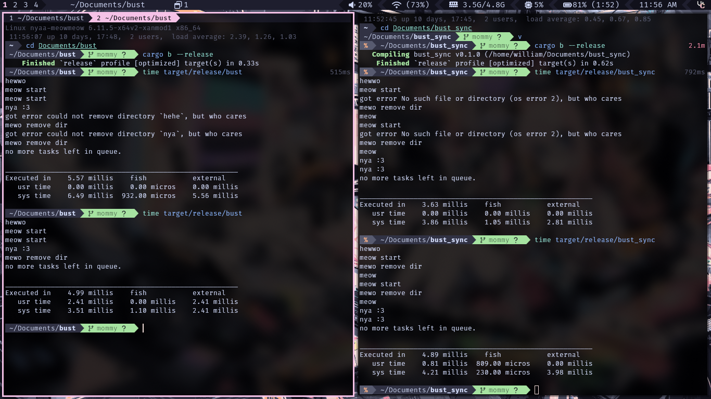

# Luminal

[](https://opensource.org/licenses/MIT)

Luminal is a high-performance async runtime designed to solve tokio's DLL boundary issues while maintaining similar performance and API compatibility. It works in both `std` and `no_std` environments.

📖 **[no_std Documentation](NOSTD.md)** - Complete guide for using Luminal in embedded and constrained environments



## Key Features

- **DLL Boundary Safe**: Unlike tokio, Luminal doesn't rely on thread-local storage, making it 100% safe to pass across DLL boundaries
- **Explicit Handle Passing**: All runtime context is explicit rather than implicit via TLS
- **Drop-in Replacement**: Provides tokio-compatible APIs like `spawn`, `block_on`, and `JoinHandle`
- **Cross-Platform**: Works on Windows, Linux, and macOS
- **Multi-threaded**: Uses a work-stealing scheduler with multiple worker threads for optimal CPU utilization (std only)
- **Efficient Work Stealing**: Implements a sophisticated work-stealing algorithm to distribute tasks evenly across worker threads
- **Memory Efficient**: Minimizes allocations and memory overhead in the task scheduling system
- **🔧 no_std Support**: Full async runtime support for embedded and constrained environments with `alloc`
- **Single-threaded Mode**: Simplified execution model for no_std environments

## Installation

Add Luminal to your `Cargo.toml`:

### For `std` environments (default):
```toml
[dependencies]
luminal = "0.3.0"
```

### For `no_std` environments:
```toml
[dependencies]
luminal = { version = "0.3.0", default-features = false }
```

See the **[no_std guide](NOSTD.md)** for detailed instructions on using Luminal in embedded environments.

## Basic Usage

```rust
use luminal::Runtime;

async fn hello_world() {
    println!("Hello, world!");
}

fn main() {
    let rt = Runtime::new().unwrap();
    let rt_clone = rt.clone();
    rt.block_on(async move {
        rt_clone.spawn(hello_world()).await;
    });
}
```

## Explicit Runtime Usage

```rust
use luminal::Runtime;

fn main() {
    let rt = Runtime::new().unwrap();
    rt.block_on(async {
        println!("Running on Luminal runtime!");
    });
}
```

## DLL Boundary Safety

Unlike tokio, which uses thread-local storage for its runtime context, Luminal uses explicit context passing. This makes it safe to use across DLL boundaries:

```rust
// Inside a DLL
fn dll_function(runtime: luminal::Runtime) -> u32 {
    // Safe to use the runtime passed from outside
    runtime.block_on(async { 42 })
}

// From the main application
fn main() {
    let rt = luminal::Runtime::new().unwrap();
    let result = dll_function(rt.clone());
    assert_eq!(result, 42);
}
```

## API Reference

### Runtime

The central coordination point for the Luminal async runtime:

```rust
// Create a new runtime
let rt = Runtime::new().unwrap();

// Spawn a task and get a JoinHandle
let handle = rt.spawn(async { 42 });

// Block and wait for a future to complete
let result = rt.block_on(handle);

// Get a handle to the runtime
let handle = rt.handle();

// Check runtime stats (queue length and processed tasks)
let (queue_len, tasks_processed) = rt.stats();
```

### Handle

A lightweight handle to a Runtime:

```rust
// Get a handle from an existing runtime
let handle = rt.handle();

// Spawn tasks using the handle
let task = handle.spawn(async { 42 });

// Block on futures using the handle
let result = handle.block_on(task);
```

### Global Functions

For convenience, Luminal also provides global functions (only available with `std` feature):

```rust
use luminal::{spawn, block_on};

// Spawn a task on the current thread's runtime
let handle = spawn(async { 42 });

// Block on a future using the current thread's runtime
let result = block_on(handle);
```

**Note**: Global functions use thread-local storage and are only available when the `std` feature is enabled. For `no_std` environments, always use explicit runtime instances.

## Benchmarks

Luminal includes comprehensive benchmark suites for:

1. High throughput task processing
2. CPU-intensive workloads
3. Mixed workload scenarios
4. Memory pressure testing
5. Multi-runtime concurrency

Run benchmarks with:

```bash
cargo run --release
```

## Testing

Run the test suite with:

```bash
cargo test
```

## Why Luminal?

- **No TLS Dependencies**: Unlike tokio, Luminal doesn't rely on thread-local storage, making it safe for DLL boundaries
- **Explicit Context**: All runtime context is passed explicitly, making it easier to reason about and debug
- **High Performance**: Designed with performance in mind, with minimal overhead compared to tokio
- **API Compatibility**: Familiar API for tokio users, making migration easier

## License

This project is licensed under the MIT License - see the [LICENSE](LICENSE) file for details.
